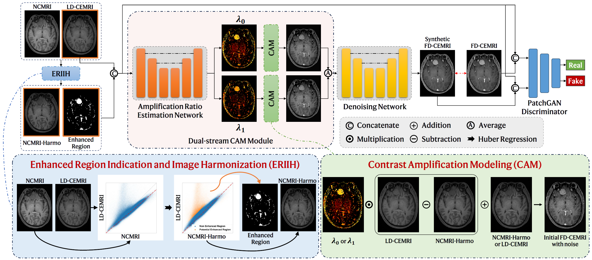

# DRCAM: Dose Reduction via Contrast Amplification Modeling for Brain Contrast-Enhanced Magnetic Resonance Images

# 🚧 Repository Update in Progress 🚧  

## 1. Overview
</img>

Contrast agent dose reduction is desired for the acquisition of contrast-enhanced magnetic resonance images (CEMRIs), but it can degrade image contrast and increase the difficulty of image interpretation.
To address the problem, previous works synthesize virtual full-dose CEMRIs (FD-CEMRIs) with desired image contrast based on low-dose CEMRIs (LD-CEMRIs) and non-contrast magnetic resonance images~(NCMRIs).
However, these methods use generic image synthesis models and overlook the signal relationship between NCMRIs, LD-CEMRIs, and FD-CEMRIs, which can serve as valuable prior knowledge for the synthesis problem.
In this work, we integrate the signal relationship into the synthesis of FD-CEMRIs from LD-CEMRIs and NCMRIs.
Assuming that the difference between the FD-CEMRI and LD-CEMRI/NCMRI is the amplified difference between the LD-CEMRI and NCMRI, we convert the original synthesis problem into amplification ratio estimation.
To suppress image noise that is also magnified in the amplification, our synthesis model comprises a dual-stream contrast amplification modeling module followed by a denoising component.
The dual-stream amplification obtains two versions of initial FD-CEMRIs by amplifying the signal difference based on the LD-CEMRI and NCMRI separately.
They are fused to reduce the impact of noise and fed into the denoising component to produce the final result.
Moreover, we propose to indicate potential enhanced regions as an auxiliary input via intensity alignment between the NCMRI and LD-CEMRI.
Our method is named DRCAM, representing Dose Reduction via Contrast Amplification Modeling.
DRCAM was validated on three datasets, and experimental results show that DRCAM improves the quality of synthesized FD-CEMRIs compared to state-of-the-art methods.